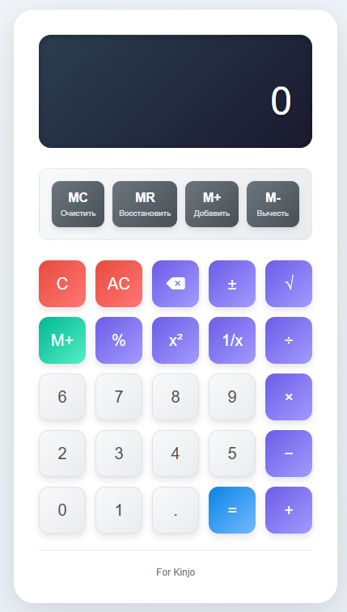
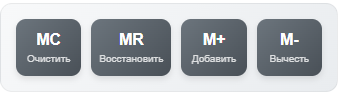
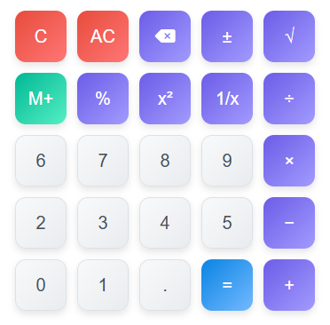
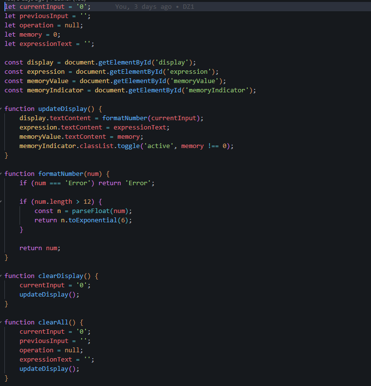
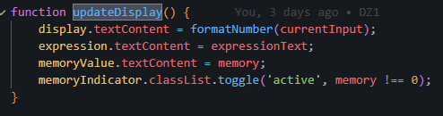

**Руководство пользователя калькулятора**  

---

Для запуска онлайн калькулятора надо нажать на файл index.html, предварительно скачав репозиторий.  

  

Перед вами калькулятор)  
В верхней части отображается дисплей.  

  

Ниже располагаются кнопки для работы с памятью.  

  

Ещё ниже находятся кнопки для заполнения данными калькулятора, а так же некоторые с разными функциями для его работы.  

  

---

Вся работа калькулятора риализована в script.js)  

  

Есть пример из файла, где вверху идёт базовая инициализация (создание переменных, взятие ссылок на объекты классов из index.html) и тд.  

Так же стоит отметить что любое действие кнопок при нажатии обновляет данные через функцию updateDisplay()  

 

---

Вроде написал, но так лень это всё описывать, мне тоже надо работать)